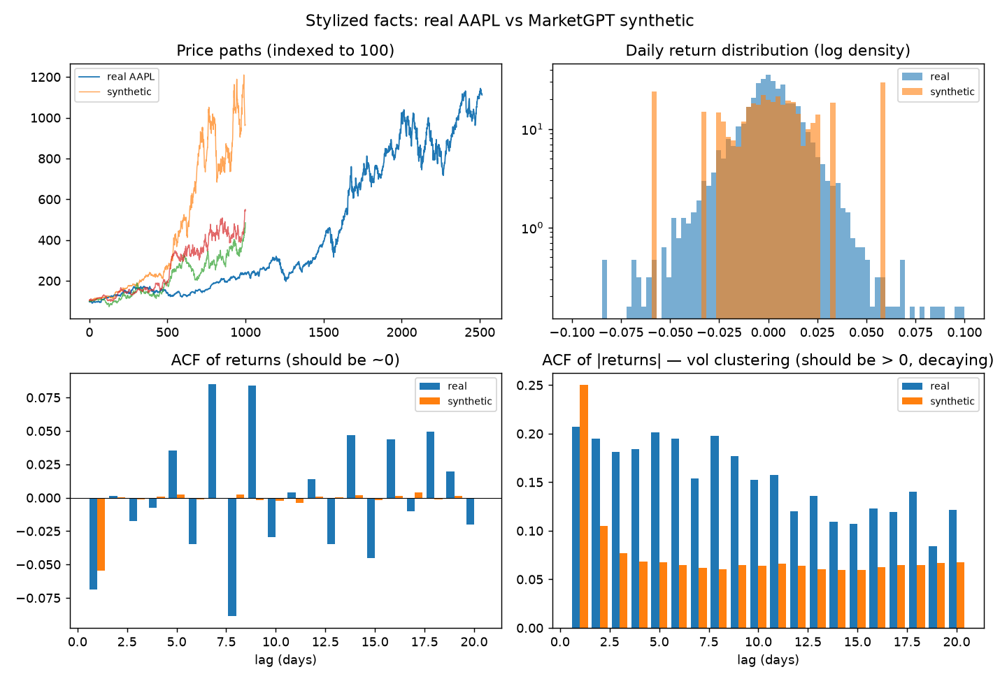
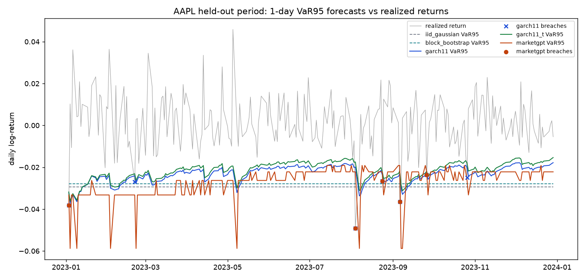
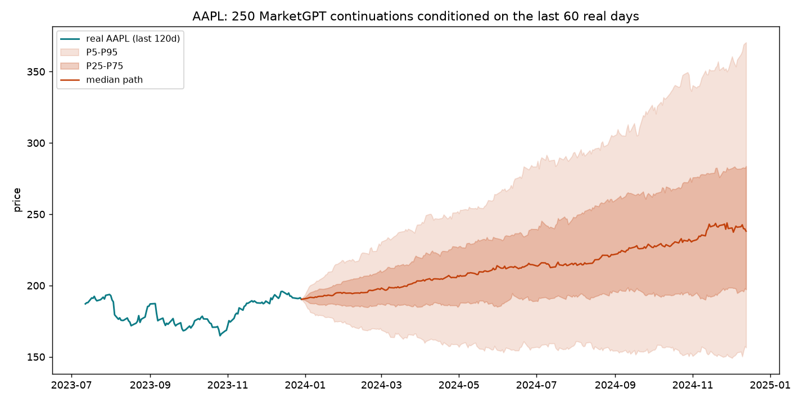

# Deephaven Time-Series Analysis — Stock "What-If" Engine

A local, containerized [Deephaven](https://deephaven.io) stack for stock-market
**"what-if"** analysis over historical price data. Prices are pulled for free from
Yahoo Finance via [`yfinance`](https://github.com/ranaroussi/yfinance), loaded into
live Deephaven tables, and explored through reactive `deephaven.ui` dashboards — no
JavaScript or CSS required. Three dashboards ship, backed by a tested pure-Python
engine package (`marketlab`) that also trains a small generative model of returns:

- **[`market_sim_dashboard.py`](scripts/market_sim_dashboard.py)** — a full trading
  **simulator**: pick one of ~20 free-data tickers and a strategy, set capital and
  parameters, and watch it trade against an *unfolding* historical market (animated
  with Deephaven `TableReplayer`) on a Sunbird-style multi-panel board.
- **[`fan_chart_dashboard.py`](scripts/fan_chart_dashboard.py)** — a **probability
  cone** over a ticker's next N trading days: a tiny transformer ("MarketGPT",
  trained on this universe — see below) is prompted with the last 60 real days and
  sampled for hundreds of continuations, with Monte-Carlo strategy KPIs over those
  same sampled futures.
- **[`var_monitor_dashboard.py`](scripts/var_monitor_dashboard.py)** — a **live
  risk monitor with the models in the loop**: the untouched 2023 test year
  replays as a raw bar feed while a table listener runs four models per tick
  (a real torch forward for MarketGPT, an O(1) GARCH fold), publishing VaR
  forecasts, a breach blotter, and a ticking scorecard with measured
  per-model inference latency.
- **[`what_if_dashboard.py`](scripts/what_if_dashboard.py)** — the simpler baseline:
  two price sliders over a single INTC table.

> **Status:** working. The stack builds and runs, and both dashboards are
> implemented and verified end-to-end against the live engine (Deephaven 41.7).

## Stack

| Layer        | Choice                                            |
| ------------ | ------------------------------------------------- |
| Engine / IDE | Deephaven Community Core (`ghcr.io/deephaven/server:latest`) |
| Data source  | `yfinance` (Yahoo Finance) — no API key, free     |
| UI           | `deephaven.ui` (Python-driven reactive components)|
| Backtesting  | `marketlab` — pure-Python engine package, pytest-covered |
| Generative ML| PyTorch — MarketGPT, a 21.6K-param causal transformer over return tokens |
| Runtime      | Docker + Docker Compose; host-side training via `uv` venv |

## Project structure

```
.
├── Dockerfile            # Deephaven server image + project Python deps + marketlab
├── docker-compose.yml    # Local service definition (web IDE on :10000)
├── requirements.txt      # container Python deps (yfinance, pandas)
├── requirements-dev.txt  # host-side dev deps (pytest, ruff, torch, ...)
├── pyproject.toml        # pytest/ruff configuration
├── .github/workflows/    # CI: ruff + pytest on every push
├── .dockerignore         # keeps the build context lean
├── .gitignore
├── docs/SPEC.md          # original project spec / requirements
├── data/                 # Deephaven data root — git-ignored, created at runtime
├── marketlab/            # pure-Python engine package (no deephaven imports)
│   ├── data.py           #   universe download / parquet cache / slicing
│   ├── backtest.py       #   strategy signals + portfolio accounting + run_backtest
│   ├── tokenizer.py      #   daily returns <-> 64 quantile-bin tokens
│   ├── model.py          #   MarketGPT: tiny causal transformer + ticker embedding
│   ├── train.py          #   temporal-split training w/ early stopping (host-side)
│   ├── sample.py         #   path generation: temperature, real-prefix conditioning
│   ├── evaluate.py       #   stylized-facts metrics + comparison figure
│   ├── mc.py             #   Monte-Carlo: strategy outcomes over N synthetic paths
│   ├── baselines.py      #   iid / block-bootstrap / GARCH(1,1) + MarketGPT VaR wrapper
│   ├── var_backtest.py   #   Kupiec, Christoffersen, Basel zones, bake-off leaderboard
│   └── stream.py         #   per-tick streaming forecasters + ForecastEngine
├── artifacts/            # committed trained checkpoint (~96 KB) + eval figure
├── tests/                # pytest suite for marketlab (hand-computed expectations)
└── scripts/              # mounted into the IDE "Notebooks" panel
    ├── market_sim_dashboard.py  # trading simulator (20 tickers, strategies, replay)
    ├── fan_chart_dashboard.py   # MarketGPT probability cone + MC strategy KPIs
    ├── var_monitor_dashboard.py # live VaR monitor: replayed breaches + scorecard
    └── what_if_dashboard.py     # simpler INTC buy/sell-price what-if
```

The split matters: everything path-dependent (signals, fills, equity, drawdown)
lives in `marketlab`, which never imports `deephaven.*` — so it runs headlessly
under pytest on the host, while the dashboard scripts stay thin Deephaven layers
over it. The container gets the package via `PYTHONPATH=/opt/project` plus a
live bind-mount, so package edits apply without a rebuild.

## Prerequisites

- **Docker Engine + Docker Compose v2** — verify with `docker compose version`.
- No API keys or cloud accounts required.

## Getting started

1. Build the custom image and start the stack:
   ```bash
   docker compose up -d
   ```
2. On first run, grab the auto-generated pre-shared key from the logs:
   ```bash
   docker compose logs deephaven | grep -i "pre-shared key"
   ```
3. Open the IDE at <http://localhost:10000/ide> and paste the key when prompted.
4. Stop the stack when done:
   ```bash
   docker compose down
   ```

> Tip: to skip the per-restart key lookup, pin a fixed PSK by uncommenting the
> `environment` block in `docker-compose.yml`.

## The market simulator

[`scripts/market_sim_dashboard.py`](scripts/market_sim_dashboard.py) is the
flagship — a trading simulator that backtests a strategy against an *unfolding*
historical market. Because `./scripts` is mounted to `/data/storage/notebooks`, it
appears in the IDE **Notebooks** panel; open it and run it to bind `dashboard`, a
multi-panel board.

- **Universe** — ~20 large-cap tickers (`AAPL`, `MSFT`, `NVDA`, …) downloaded once
  via one batched `yfinance` call and cached under `data/`.
- **Strategies** (dropdown) — SMA crossover, buy-the-dip, and dollar-cost
  averaging. Every trade fills at the day's market `Close` (no manual buy price).
- **Unfolding replay** — the chosen run's full backtest is precomputed, then
  revealed over a ~90s wall-clock window via `TableReplayer`; every panel updates
  live as the market "unfolds."
- **Controls** — ticker, strategy, initial capital, per-strategy parameters, date
  range, and a Restart button.
- **Panels** — six KPI cards (final value, total return, vs buy-&-hold, max
  drawdown, # buys, win rate), an equity curve vs buy-&-hold, price + MA overlays
  with buy/sell markers, an exposure (in-market vs cash) area chart, a live trade
  log, and a monthly-returns bar chart.

How it works: the path-dependent backtest is computed in the `marketlab` package
(signals, positions with a one-bar execution lag, equity, drawdown — pure
pandas/numpy, unit-tested), converted to a Deephaven table, given a compressed
`ReplayTime` column, and replayed. The charts
(`deephaven.plot.express`) and trade log bind to the replaying table and animate as
it unfolds; the KPI cards show the final backtest result. The `TableReplayer`
lifecycle is managed inside the `@ui.component` with `use_effect`/`use_ref`.

## The simple what-if dashboard

[`scripts/what_if_dashboard.py`](scripts/what_if_dashboard.py) is the original,
simpler baseline (per the [project spec](docs/SPEC.md)): ~10 years of Intel
(`INTC`) loaded via `deephaven.pandas.to_table`, with two `ui.slider` controls
driving `calculate_profit(buy, sell)` — it keeps days where `Close <= buy_price`
and adds `Simulated_Profit = sell_price - Close`, recomputing reactively.

> Both run entirely on free historical data — no API keys. They need outbound
> internet (from the container) for the one-time `yfinance` download.

## The generative layer: makemore for markets

`marketlab` also ships a small **generative model of daily returns** — the same
autoregressive recipe as Karpathy's makemore, transplanted: names are sequences
of characters, markets are sequences of return buckets. Daily log-returns are
tokenized into 64 quantile bins (fit on training years only), and a tiny causal
transformer (1 layer, 32-dim, 21.6K params, learned per-ticker embedding) is
trained to predict the next day's bucket. It is explicitly **not** a price
predictor — it's a distribution model used to generate *plausible synthetic
market histories* for robustness testing.

**Honesty bar.** The split is three-way and temporal: gradients see 2014–2021
only, early stopping selects on 2022 only, and 2023 is touched by *nothing* —
it stays clean for the VaR bake-off below. Training reports validation
cross-entropy against the *marginal baseline* (predicting every day from the
unconditional training distribution). Bigger or lightly-regularized configs
memorize the training years and **lose** to that baseline out-of-sample; the
shipped config wins, 4.018 vs 4.159 nats/token on the 2022 validation year —
a small, real edge consistent with the fact that daily returns are mostly
noise plus volatility structure.

**Stylized-facts evaluation** (`python -m marketlab.evaluate`), synthetic vs
real AAPL:



- Raw-return autocorrelation ~0 in both — the generator doesn't hallucinate
  predictability.
- **Volatility clustering is genuinely learned**: mean |return|-ACF +0.076
  synthetic vs +0.153 real (an iid generator scores ~0). Captured, but
  under-strength — stated as-is.
- Tails run thin (excess kurtosis 0.5 vs 5.7): decoding tokens to per-bin
  means caps extreme moves at the outer bins' averages. A known tokenizer
  trade-off, not a modeling win.
- Empirical surprise: sampling temperature acts as a **regime-persistence
  dial here, not a tail dial** — low temperature amplifies the model's
  self-exciting volatility feedback (realized vol rises), high temperature
  washes conditionals toward the iid marginal.

**Monte-Carlo robustness** (`python -m marketlab.mc`): run a strategy over
hundreds of generated histories and see where the real result lands. SMA(20/100)
on AAPL, last ~3y window, $10K, 500 synthetic paths:

| metric        | p5     | p50    | p95    | real   | real %ile |
|---------------|--------|--------|--------|--------|-----------|
| final value   | $8,389 | $22,087| $83,024| $12,159| 16%       |
| vs buy & hold | -61%   | -33%   | +12%   | -19%   | 76%       |
| max drawdown  | -49%   | -30%   | -19%   | -33%   | 39%       |

The takeaway a single backtest can't give you: SMA's underperformance vs
buy-and-hold on real AAPL was **not bad luck** — it underperforms in the large
majority of plausible histories too.

To retrain from scratch (a few minutes on Apple Silicon):

```bash
.venv/bin/python -m marketlab.train --cache data/universe_cache.parquet --out artifacts
```

## Which generator should a risk desk trust? (VaR backtesting)

`python -m marketlab.var_backtest` runs a judged bake-off: five scenario
generators behind one interface — iid Gaussian, 20-day block bootstrap,
hand-rolled GARCH(1,1) with normal and with Student-t innovations
([marketlab/baselines.py](marketlab/baselines.py)), and MarketGPT, whose
per-step softmax over return buckets *is* a conditional distribution forecast,
so its VaR is a cumulative-probability read off one forward pass.

**Leak-free protocol.** MarketGPT trains on 2014-2021 and early-stops on 2022
only; the classical models fit on everything through 2022 (strictly *more*
data than MarketGPT's gradients ever saw); every model then forecasts a 1-day
95%/99% VaR for each of 5,000 pooled 2023 days (all 20 tickers) — a year
nothing was trained, fit, or selected on — using only information through the
prior day. Scoring is the regulated kind:

- **Kupiec**: is the breach *rate* consistent with the target?
- **Christoffersen**: do breaches *cluster*? (The signature of missed vol
  dynamics — a model can pass Kupiec while dumping every breach into one bad
  month.)
- **Basel traffic light**: the regulatory zones for 99% VaR (breaches per 250
  days: green < 5, yellow 5-9, red >= 10).

| model           | 95% breach rate | Kupiec p (95%) | 99% breach rate | Kupiec p (99%) | Christoffersen p (95%) | 99% light |
|-----------------|-----------------|----------------|-----------------|----------------|------------------------|-----------|
| iid Gaussian    | 2.42%           | 0.000          | 0.64%           | 0.006          | 0.096                  | green     |
| block bootstrap | 3.08%           | 0.000          | 0.36%           | 0.000          | 0.026                  | green     |
| GARCH(1,1)-N    | 3.94%           | 0.000          | 1.40%           | 0.007          | 0.292                  | green     |
| **GARCH(1,1)-t**| **4.60%**       | **0.189**      | **0.78%**       | **0.104**      | **0.856**              | green     |
| MarketGPT       | 3.84%           | 0.000          | 0.58%           | 0.001          | 0.016                  | green     |

Two findings worth the whole project. **First, the leakage fix changed the
verdict — which is the whole reason such fixes matter.** An earlier run
tested on 2022-2023, the same window MarketGPT's checkpoint had been
early-stopped on (a disclosed selection caveat at the time); there, MarketGPT
looked uniquely well calibrated. On the clean 2023-only protocol, nearly
every model fails Kupiec **in the conservative direction**: fit on data
containing 2022's turbulence, they over-covered 2023's calm. Regime shift
dominates model choice; all five are Basel-green at 99% because the traffic
light only penalizes *excess* breaches — over-coverage reads as
compliant-but-capital-inefficient, which is exactly how a risk desk would
describe it.

**Second, the classical fat-tail upgrade wins outright.** Student-t GARCH is
the only model passing every coverage test at both levels, and the mechanism
is a beautiful exam answer: a *unit-variance* Student-t has thinner shoulders
than a normal (its 5% quantile is shallower, so t-GARCH breaches more at 95%,
offsetting the regime over-coverage) and fatter tails (its 1% quantile is
deeper, taming normal-GARCH's 99% over-breaching). Same variance recursion,
right innovation distribution, both calibration errors fixed at once.
MarketGPT keeps the cleanest 99% breach independence among the rest (p=0.56)
but under-breaches like everything except t-GARCH.



Remaining caveats, disclosed rather than buried: with n = 5,000 pooled days
the coverage tests are powerful enough to reject economically small
deviations; and one calm test year is one draw — the over-coverage finding
says as much about 2023 as about the models.

## The live VaR monitor

[`scripts/var_monitor_dashboard.py`](scripts/var_monitor_dashboard.py) replays
the bake-off the way a risk desk would experience it — and **the models are in
the loop**. The replayer streams only raw 2023 bars (the "exchange feed"); a
Deephaven table listener reacts to every tick by advancing each model's state
incrementally via [`marketlab/stream.py`](marketlab/stream.py) — GARCH's
variance recursion as an O(1) stream fold, MarketGPT as a real torch forward
pass per bar — and publishes forecasts and breach events through
`DynamicTableWriter`s into the ticking tables the panels consume. Every VaR
number on screen was computed *after* its bar arrived:

- the **VaR-vs-realized chart** extends day by day, each point a fresh
  inference — flat unconditional lines sitting too deep through 2023's calm
  while GARCH and MarketGPT relax with decaying volatility;
- the **breach blotter** grows as exceptions happen (the Jan 3 2023 -3.8% bar
  breaches all four models at once), newest on top;
- the **live scorecard** is a ticking `agg_by` per model — days observed,
  breaches, running breach rate, Basel zone, and **AvgLatencyMs**: measured
  per-tick inference cost, live. On the arm64 container: MarketGPT ~4-6 ms
  per bar, the GARCH fold ~0.2 ms;
- the full-period pooled leaderboard sits beside it as the static answer key.

Correctness is pinned by a **stream/batch parity test**
([tests/test_stream.py](tests/test_stream.py)): feeding returns one-at-a-time
through the streaming models reproduces the batch `var_series` used by the
leaderboard — the incremental math IS the backtested math, just folded. The
breach semantics match a real desk too: an exception is only knowable when the
new bar arrives and is compared against the forecast made the day before.

## The fan-chart dashboard

[`scripts/fan_chart_dashboard.py`](scripts/fan_chart_dashboard.py) puts the
generative model behind an interactive Deephaven dashboard. The committed
checkpoint loads in-container (CPU torch); every press of **Generate** prompts
it with the chosen ticker's last 60 real trading days and samples hundreds of
continuation paths *live*, rendering:

- the 5/25/50/75/95 **percentile cone** joined to recent real history (below,
  the same data rendered for the README — the dashboard version is interactive);
- **Monte-Carlo KPI cards** for a chosen strategy run over those same sampled
  futures: P(beats buy & hold), median and 5th-percentile final value,
  5th-percentile max drawdown.



Controls: ticker, strategy, horizon (30–250 days), sampling temperature, path
count. The caption says it plainly: the cone is a distribution, not a forecast —
the median line is not a price target. In-container sampling of 250 paths x 250
days takes a few seconds on Apple Silicon (native arm64 image).

## Development & testing

The engine package is developed and tested on the host — no container needed:

```bash
uv venv --python 3.12 .venv
uv pip install --python .venv/bin/python -r requirements-dev.txt
.venv/bin/python -m pytest -q        # unit tests (hand-computed expectations)
.venv/bin/python -m ruff check .     # lint
```

The same checks run in CI ([.github/workflows/ci.yml](.github/workflows/ci.yml))
on every push once the repo has a GitHub remote.

## Notes

- `data/` is git-ignored: it holds the local Deephaven data root and any
  downloaded data, and is recreated at runtime.
- `pandas` is intentionally left unpinned in `requirements.txt` so it defers to
  the version bundled in the Deephaven base image.

## Roadmap

- **Done:** historical backtests + an animated `TableReplayer` "unfolding market";
  tested `marketlab` engine package + CI; MarketGPT generative layer with
  stylized-facts evaluation and Monte-Carlo strategy robustness.
- **Done:** the fan-chart dashboard — live in-container sampling of prefix-
  conditioned continuations with Monte-Carlo strategy KPIs.
- **Done:** the generator bake-off — GARCH/bootstrap/iid baselines vs MarketGPT,
  judged by VaR coverage backtesting (Kupiec, Christoffersen, Basel traffic
  light) on a leak-free three-way split (train 2014-2021, select 2022, test
  2023) — a fix that changed the verdict.
- **Done:** the live VaR monitor dashboard — the bake-off replayed with a
  ticking scorecard, breach blotter, and traffic-light zones, upgraded to
  per-tick listener inference (models in the loop, latency measured live,
  stream/batch parity tested).
- **Done:** Student-t GARCH — the only model passing every coverage test on
  the clean protocol; the fat-tail upgrade fixes both calibration errors at
  once.
- **Later (optional):** joint multi-ticker generation (correlation under
  stress), live ticking data (e.g. Alpaca, Alpha Vantage) into the engine.
